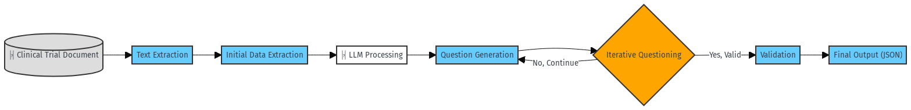

# Trial-LLM

## Project Overview

This project presents a cutting-edge system designed to extract, analyze, and validate clinical trial data, with a specific emphasis on immunology trials. By leveraging advanced Large Language Models (LLMs), the system automates the process of extracting critical clinical data points from unstructured sources like PDF documents. It supports data from trials on immunological treatments (e.g., rheumatoid arthritis, lupus) and enhances understanding by generating dynamic queries. The system uses iterative questioning and dynamic validation to ensure extracted insights meet a high standard of accuracy and relevance, even for complex or scattered trial data.

## Objectives

1. **Automated Clinical Trial Data Extraction**: Extract vital clinical endpoints such as trial outcomes, adverse events, safety profiles, and statistical significance from immunology-focused trials.
2. **Iterative Question-Answering and Data Refinement**: Implement a dynamic question-generation and iterative extraction process to improve data accuracy and relevance by progressively refining responses to specific queries.
3. **Validation and Data Integrity**: Use structured validation techniques (e.g., Pydantic models) to ensure extracted data is accurate, complete, and adheres to predefined schema models.

## Why This Approach?

The methodology is designed to handle complex clinical trials by focusing on:

Handling clinical trials is inherently challenging due to the diversity and complexity of data presentation. This system is designed to address these challenges through:

**Structured and Unstructured Data Extraction**: Immunology trials often span several years and involve both immediate and long-term outcomes. This system automatically identifies and extracts data such as efficacy endpoints, adverse events, and safety analyses, vital for medical research.

**Iterative Querying with LLMs**: Unlike traditional one-pass extraction, this system uses an iterative querying approach, allowing for multiple extraction passes on a document. This improves precision, especially when dealing with difficult-to-locate or hidden data points in clinical trial reports.

**LLM-Assisted Insight Refinement**: By leveraging state-of-the-art LLMs, the system can infer complex relationships in clinical trial data, such as subtle trends in patient demographics or secondary outcomes, making it uniquely suited for fields like immunology that require high levels of technical understanding.

## Unique Advantages

**Immunology-Centric Extraction**: Designed with a focus on immunology trials, the system uses specialized prompts and predefined question sets tailored to diseases such as rheumatoid arthritis and lupus. This ensures that data relevant to immunological research is prioritized during extraction.

**Dynamic Iterative Questioning**: Traditional extraction methods are often limited by their ability to capture scattered or less obvious data. Through iterative refinement based on intermediate results, this system ensures a complete and accurate dataset is built by revisiting sections of the trial report until an optimal extraction is achieved.

**LLM-Powered Question-Answering**: The system leverages the deep language understanding capabilities of LLMs to craft follow-up questions and refine the data extraction process. This allows the system to gather insights typically missed by manual reviews, enhancing the efficiency and scalability of the data extraction process.

**Validation**: Using Pydantic models ensures that extracted data adheres to strict validation protocols, maintaining both the structural integrity and correctness of the extracted data. This is crucial for the reliability of clinical trial insights and improves robustness across datasets.



## Example Workflow

### Input:

Clinical trial documents are provided as PDF files, stored in `data/articles/`. Example trials include:

- Assessment of Clinical Analgesic Levels and Serum Biomarkers in Patients with Rheumatoid Arthritis
- Efficacy and safety of upadacitinib in patients with rheumatoid arthritis

### Questions:

The system processes specific questions, which are stored in `data/questions.json`. Example questions include:

```json
[
{
"id": 1,
"difficulty": "easy",
"question": "What were the primary outcomes of the clinical trial for lupus?"
},
{
"id": 2,
"difficulty": "complicated",
"question": "Compare the adverse event profiles and statistical outcomes of immunotherapy treatments in clinical trials for rheumatoid arthritis."
}
]
```

### Process:

1. **Extract Text from PDF**: The system extracts the raw text from the PDF files using pdfplumber.
2. **Initial Extraction**: The system extracts key features from the text, including outcomes, adverse events, and statistical details, using the `initial_extraction` function.
3. **Iterative Questioning**: If the answer to the query is incomplete or not satisfactory, the system generates follow-up questions and performs additional extractions until it reaches a satisfactory confidence score.
4. **Question Generation**: Follow-up questions are dynamically generated to refine the query process.
5. **Validation**: The output is validated using custom validations, ensuring the integrity and structure of the data.

### Example Output:

Here is an example JSON output from a processed question:
```json
{
"question_id": 2,
"question_text": "Compare the adverse event profiles and statistical outcomes of immunotherapy treatments in clinical trials for rheumatoid arthritis.",
"related_article": "Efficacy and safety of upadacitinib in patients with rheumatoid arthritis",
"steps_taken": 3,
"confidence_score": 0.85,
"final_answer": {
"description": "The trial compared the adverse events between upadacitinib and other immunotherapies. Upadacitinib showed a lower rate of serious adverse events (2%) compared to other treatments.",
"metadata": {
"authors": ["Dr. John Doe", "Dr. Jane Smith"],
"publication_date": "2023-04-10",
"journal": "Immunology Research"
},
"extracted_features": [
{"description": "Adverse Events", "value": "Common: Nausea, Headache; Serious: 2% serious infections"}
]
},
"follow_up_questions": [
{"question": "What are the secondary outcomes?"},
{"question": "What is the confidence interval for serious adverse events?"}
]
}
```

## Technical Process Description

1. **PDF Extraction**
   The clinical trial documents are first parsed using pdfplumber to extract raw text. This is critical in converting the often scattered and complex structure of clinical trial documents into analyzable text.

2. **Initial Data Extraction**
   Once the text is extracted, the `initial_extraction` function processes the text based on the user's query. It looks for predefined key features such as:
   - Primary and Secondary Outcomes
   - Adverse Events
   - Statistical Significance
   This is done using a combination of prompt engineering and parsing rules to extract the relevant content.

3. **Iterative Questioning**
   The system doesn't stop at the first attempt to extract data. If it detects that a question hasn't been fully answered (based on a confidence scoring mechanism), it generates follow-up questions using the `question_generation.py` script. These follow-up questions help in refining the answer until a satisfactory result is reached.

4. **Validation with Pydantic**
   After data extraction, the system validates the structure and content of the extracted data using Pydantic models. This ensures that:
   - All expected fields are present.
   - Data like publication dates follow the correct format (YYYY-MM-DD).
   - Answers and metadata conform to the expected structure.

5. **JSON Output Generation**
   Once the extraction, refinement, and validation are complete, the final results are saved as JSON files, which include detailed responses to the questions, metadata, and confidence scores.