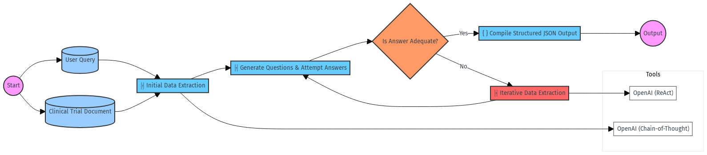

# Iterative Clinical Trial Data Extraction and Analysis System

In the pharmaceutical industry, analyzing and interpreting clinical trial data is crucial for drug development and approval processes. Clinical trial documents often come in various formats and structures, containing complex and detailed information. Traditional methods of data extraction and analysis can be time-consuming and may not efficiently handle the diversity and complexity of these documents.

This project proposes an AI-driven system that utilizes an iterative process to extract, interpret, and standardize information from clinical trial documents. By leveraging advanced natural language processing (NLP) techniques and tools, the system aims to generate factually correct, consistent, and dynamic outputs, transforming diverse clinical trial documents into standardized formats that are easy to analyze and interpret for medical researchers.

## Goals and Objectives
Primary Goal:

Transform complex clinical trial documents into standardized, accurate, and insightful JSON outputs.
#### Objectives:

- Implement an iterative question-answering mechanism to handle queries requiring data extraction.
- Ensure all outputs adhere to a consistent JSON schema.
- Utilize OpenAI models, supplemented with tools like MetaMap and UMLS as optional enhancements.
- Maintain data accuracy and prevent over-iteration when data is unavailable.

### Unique Advantages
- ReAct Prompting Technique: Employs the Reasoning and Acting prompting method to iteratively extract information needed for questions.
- Chain-of-Thought (CoT) Prompting: Guides the model through step-by-step reasoning, improving accuracy on tasks.
- Structured Outputs: Consistently formatted JSON outputs facilitate integration and analysis.
- Flexibility: Processes documents of varying formats without extensive reconfiguration.

## Technical Methodology
### Overview


The system leverages advanced prompting techniques to guide the language model in extracting and organizing data from clinical trial documents.

Key Components
1. Dynamic Prompt Templates:

Concept:
Adjust prompts dynamically based on document content and query specificity.
Advanced Methods:
Template Engines: Use engines like Jinja2 to create prompt templates with placeholders that are filled programmatically.
Query Analysis: Analyze queries to select appropriate prompt templates.

2. ReAct Prompting Technique:

Combines reasoning and action steps.
Enables the model to iteratively identify missing information and extract it.

3. Chain-of-Thought (CoT) Prompting:

Encourages step-by-step reasoning.
Enhances accuracy on complex extraction tasks.

4. Metadata Extraction:

Extracts metadata such as authors, publication date, and journal for comprehensive outputs.

5. Structured Output Enforcement:

Prompts include explicit instructions to output data in a predefined JSON schema.
Uses parsing and validation to maintain structure during iterations.
Accepts custom data types in JSON validation to handle industry standards.

## Process Flow
1. Initial Data Extraction:

Input: Clinical trial document and user query.
Method: Apply CoT prompting with dynamic templates to extract key features and metadata.
Output: Preliminary JSON with extracted data and metadata.

2. Question Generation and Answering:

Generate relevant questions based on initial extraction.
Attempt to answer questions using extracted data.

3. Iterative Mechanism with ReAct Prompting:

If unable to answer a question adequately:
The model identifies missing data.
Extracts additional information using ReAct prompting.

4. Maintaining Structured JSON Output:

After each iteration:
Validate output against the JSON schema, accepting custom types.
Correct any discrepancies to ensure conformity.

5. Final Output:

Compile all data into the standardized JSON format.
Deliver comprehensive answers to the user's query.
Maintaining Structured JSON Output
Output Validation:
Use JSON schema validation with custom types after each iteration.
Error Handling:
Implement exception handling to catch and correct formatting errors.
Prompt Constraints:
Include clear instructions in prompts to adhere strictly to the JSON format.

# Use Cases with Outputs
Case 1: Summarizing Phase III Clinical Trials on Biologics for Rheumatoid Arthritis
Input Prompt:

"Summarize recent Phase III clinical trials on biologics for rheumatoid arthritis."
Process:

Initial Extraction:

Extract key features such as study design, number of participants, interventions, outcomes, and statistical significance.
Question Generation:

Generate relevant questions and answers based on the extracted data.
Iteration if Necessary:

If complex questions arise that cannot be answered with initial data, the system re-extracts additional information.
Output:

A standardized JSON document containing the trial description, extracted features, questions with answers and options, outcome prediction, and reasoning.

```
{
  "description": "In a Phase III clinical trial, Drug Y demonstrated significant efficacy over placebo in reducing symptoms of rheumatoid arthritis.",
  "extracted features": [
    {
      "description": "Study design",
      "value": "Randomized, double-blind, placebo-controlled"
    },
    {
      "description": "Number of participants",
      "value": "500"
    },
    {
      "description": "Primary outcome measure",
      "value": "Reduction in DAS28 score at week 24"
    },
    {
      "description": "P-value",
      "value": "0.001"
    }
  ],
  "questions": [
    {
      "question": "What was the primary efficacy endpoint in the trial?",
      "answer": "The primary endpoint was the reduction in DAS28 score at week 24.",
      "options": [
        "Improvement in joint function",
        "Reduction in DAS28 score at week 24",
        "Decrease in CRP levels",
        "Patient-reported outcome measures",
        "Radiographic progression"
      ],
      "correct_option": "Reduction in DAS28 score at week 24"
    }
  ],
  "outcome": "success",
  "outcome reasoning": "The trial achieved statistical significance with a p-value of 0.001."
}
```

Case 2: Comparing Efficacy and Safety Profiles of Two Drugs in Treating Psoriasis for Older Adults
Input Prompt:

"Compare the efficacy and safety profiles of Drug A (Secukinumab) and Drug B (Ustekinumab) in treating psoriasis for older adults."
Process:

Initial Extraction:

Extract comparative data on efficacy measures (e.g., PASI scores) and safety profiles (e.g., adverse events).
Complex Question Generation:

Generate detailed questions that may require deeper data, such as specific adverse event rates in older adults.
Iterative Extraction:

Recognize that initial data is insufficient for certain questions and extract additional details focused on the older adult population.
Output:

A comprehensive JSON document with detailed comparative analysis, questions, and answers.

```
{
  "description": "Secukinumab showed higher efficacy than Ustekinumab in achieving PASI 90 responses in older adults with psoriasis but had a similar safety profile.",
  "extracted features": [
    {
      "description": "Study design",
      "value": "Randomized, double-blind, active-controlled"
    },
    {
      "description": "Number of participants (older adults)",
      "value": "200"
    },
    {
      "description": "Efficacy measure",
      "value": "PASI 90 response at week 16"
    },
    {
      "description": "Secukinumab PASI 90 response",
      "value": "70%"
    },
    {
      "description": "Ustekinumab PASI 90 response",
      "value": "50%"
    },
    {
      "description": "Adverse events (Secukinumab)",
      "value": "10% reported mild infections"
    },
    {
      "description": "Adverse events (Ustekinumab)",
      "value": "12% reported mild infections"
    }
  ],
  "questions": [
    {
      "question": "Which drug demonstrated a higher PASI 90 response rate in older adults?",
      "answer": "Secukinumab demonstrated a higher PASI 90 response rate of 70% compared to Ustekinumab's 50%.",
      "options": [
        "Secukinumab",
        "Ustekinumab",
        "Both drugs had equal response rates",
        "Neither drug showed significant efficacy",
        "Data not available"
      ],
      "correct_option": "Secukinumab"
    }
  ],
  "outcome": "success",
  "outcome reasoning": "Secukinumab achieved higher efficacy with acceptable safety profiles."
}
```

